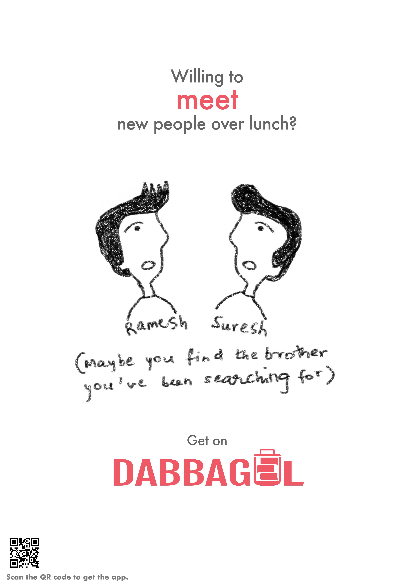

<h1 align="center">  DabbaGul</h1>

  

DabbaGul is a food sharing app where you can explore the food around you carried by other people, by uploading yours to the platform. If you're here to trade your home-made food for something equally delicious, expand your social network over food or just explore the lunches around you for the love of food, you've come to the right place.

||||
|:-:|:-:|:-:|

Explore. Connect. Eat. DabbaGul is easy to use and fun — add your lunch with appropriate photos and tags, browse the Explore Section to find the lunch boxes in your vicinity and send a request to the lunches you're interested in. If someone accepts your request, you'll be one step closer to a yummy surprise. Chat online with your connections and then step away from your phone, exchange or share your lunch in the real world and share your mouth-watering experiences with us!

Get ready to have your taste buds tickled and be spoiled with a variety of choices. And remember, when in doubt, send a request. Trust us, the more options you have, the better-looking life becomes.

## User Interface
||||
|:-:|:-:|:-:|
||||

## Contributors
- [Chirag Jain](https://github.com/chirag-jn)
- [Amogh Gulati](https://github.com/amogh-gulati)
- [Dhruv Verma](https://github.com/Dhruv-Verma)
- [Sejal Bhalla](https://github.com/sejalbhalla)
- [Bhavika Rana](https://github.com/bhavikaar)